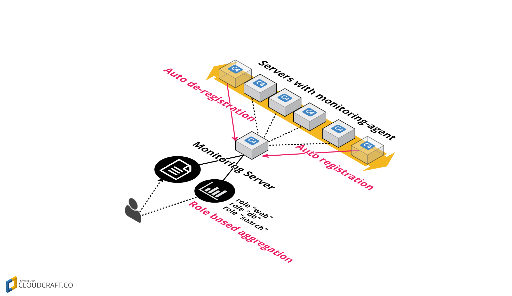
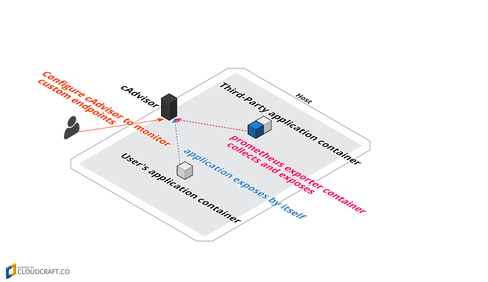

「Kubernetes のモニタリング」と言った場合、そこには 2 つの意味がある。1 つは Kubernetes 上で動くコンテナ群のモニタリング、もう 1 つは Kubernetes クラスタ自身のモニタリングだ。Kubernetes によってダイナミックに配置されるコンテナ群、 そして Kubernetes クラスタ自身をどのようにモニタリングすればいいだろうか。

# Monitoring Theory
Kubernetes のモニタリングの話に入る前に、まずは SaaS 型のモニタリングサービスである [Datadog](https://www.datadoghq.com/) が提唱するモニタリング理論を紹介したい。これは、いくつかの既存の理論をベースに、 Datadog が様々な顧客のシステムをモニタリングしてきた経験を踏まえて作られたものだ。

(余談だけど、似たものとして Heroku の [The Twelve-Factor App](http://12factor.net/) がある。The Twelve-Factor App は Heroku が顧客の様々なアプリケーションをホスティングしてきた経験から生まれたアプリケーション運用理論だ。)

詳細については以下の本家のブログを参照してもらうとして、ここでは簡単に要点を説明する。

- [Monitoring Best Practices Learned from IT Outages - PagerDuty](https://www.pagerduty.com/blog/monitoring-best-practices-it-outages/)
- [Monitoring 101: Collecting the right data](https://www.datadoghq.com/blog/monitoring-101-collecting-data/)
- [Monitoring 101: Alerting on what matters - Datadog](https://www.datadoghq.com/blog/monitoring-101-alerting/)
- [Monitoring 101: Investigating performance issues](https://www.datadoghq.com/blog/monitoring-101-investigation/)

## Collecting the right data
この理論では、以下の 3 種類のデータを集める。


### Work metrics


まず、なんでモニタリングするのかということに立ち返ると、「自分のシステムが正常に働いているかどうか」を知りたいからだとわかる。じゃあ、「自分のシステムが正常に働いているかどうか」はどうやったらわかるか。

例えば一般的な Web アプリケーションでいえば、スループットが十分に出ていたり、エラー率が低かったり、レスポンスタイムが短いことを指す。こういった「自分のシステムが正常に働いている度合いを示す」メトリクスを Work metrics という。

### Resource metrics


Work metrics は「自分のシステムが正常に働いているかどうか」を知るには有効だけど、正常じゃない場合に何が原因か知るのは使えない。例えば、Web アプリケーションのスループットが落ちていることだけ見ても何が原因かはわからない。そういう場合は、そのアプリケーションが使っている "リソース" をみる。依存しているもの、といってもいい。一般的な Web アプリケーションは CPU やメモリといったマシンリソースを使っているし、データベースも使っている。依存しているリソースをの使用状況を見ることでボトルネックが明らかになる。そういったリメトリクスを resource metrics という。

### Events


Resource metrics だけを見ていてもわからないことがある。例えば、CPU 使用率のグラフを見て、「なぜ CPU 使用率がこのタイミングから落ちてるんだろう」と思ってもそのグラフを見ているだけでは原因がわからないだろう。そういう場合に有効なのが Events だ。グラフに変化があったタイミングの前に、「サーバのスケール」 や 「デプロイ (コード変更)」 というイベントがあったならば、それに原因がありそうだとわかる。

(各種ログは、モニタリングにおいてイベントデータとも捉えられると思う)

## Alert on actionable work metrics


アラートは、アラートが出た際に行動が可能なメトリクスのみ対して出す。

Work metrics は 「自分のシステムが正常に働いているかどうか」 を示す。だから work metrics の値に異常があれば、何かしら対応が必要なはずなのでアラートを出すべきである。

反対に resource metrics については基本的にアラートは出してはいけない。例えばあるアプリケーションのメモリ使用率が 80% を超えたというアラートが出たとしても何か対応ができるとは限らない。メモリ使用率 80% が問題なのか問題でないのかは、アプリケーションに影響が出ているかどうかによるからだ。

## Investigating recursively


ここまでの説明の通り、問題があったときに調査する際は work metrics から見はじめて、 resources metrics と events を次に見る。ある resources metrics もまた何かの resources を使っているので、調査は再帰的に行う。たとえばデータベースを利用する Web アプリケーションのスループットに問題があったとしよう。Web アプリケーションにとってデータベースは 1 つのリソースであるとみなせる。そしてデータベースもまた CPU やメモリといったリソースを使っているので、アプリケーションのスループット、データベースのクエリレイテンシ、CPU やメモリといったように、ドリルダウンしていくイメージだ。

# Monitoring Containers
「Kubernetes のモニタリング」 には「Kubernetes 上で動くコンテナ群のモニタリング」と「Kubernetes クラスタ自身のモニタリング」が含まれる。Datadog のモニタリング理論をふまえつつ、まずは「Kubernetes 上で動くコンテナ群のモニタリング」について考えていこう。

## Collecting
コンテナの世界では、どうやってデータを集めるかが サーバ/VM の時とは異なる。

### Collecting in Servers / DC


クラウドがなかった時代は、設定ファイルにモニタリング対象のサーバをハードコーディングする仕組みだった。だからサーバを増設する度に設定ファイルを書き直す必要があったが、物理マシンの台数はそう頻繁に変わるものでもなかったから、そこまで問題にはならなかった。

### Collecting in VMs / Cloud


クラウドや VM が登場すると、サーバの数が増減する機会が格段に増えた。だから、サーバが増減する度に設定ファイルを書き直す仕組みでは運用できなくなった。




そこで出てきたのが Auto registration & de-registration と role based aggregation というコンセプト。モニタリングクライアント(エージェント)が自身のいるインスタンス作成時にそのインスタンスをモニタリング対象サーバに自動登録、削除時に自動抹消させるようにすることで、スケールの度に設定ファイルを書き直す必要がなくなった(Auto registration & de-registration)。

また、ロールという単位にサーバをまとめて扱うことで、サーバを 1 台 1 台見るのでなく、アプリケーションサーバグループや、キャッシュサーバグループといったようにサーバグループとして見られるようになった。 たとえば "app" というロールが付いたサーバであれば、そのサーバ名が何であろうと何台あろうとアプリケーション用のモニタリングを行う。メトリクスの可視化も同様である。(role based aggregation)。

### Collecting in Containers


コンテナの世界では、モニタリング対象アプリケーションとモニタリングエージェントを同じコンテナに入れるのは推奨されない。だから**モニタリング専用コンテナ**というものを用意する必要がある。さらに、Kubernetes や Swarm, ECS などのスケジューラと呼ばれるコンテナ管理システムを使うと、もはや**コンテナがどのホストにデプロイされるかはわからない**。

この状況に対して、以下のいずれかの方法で対応できる。

### Pattern1: Agent as side-cars container


モニタリング対象アプリケーションとモニタリングエージェントを同じコンテナに入れない代わりに、アプリケーションコンテナとモニタリングコンテナを一緒に配置する、という方法。 Kubernetes では Pod コンセプトのおかげでそれが簡単にできる。(Swarm や ECS でも同様のことが可能) 1 つの Pod にアプリケーションコンテナとモニタリングコンテナを含めてあげればよい。

### Pattern2: Agent with Service Discovery


サーバ/VM の時と同じく、各ホストマシンに 1 台ずつモニタリングエージェントをインストールする。(正確にいうと、各ホストマシンに 1 台モニタリング専用コンテナを置く)


モニタリングエージェントはそのホストでどんなコンテナが動いてるかはあらかじめ知らされてないため、Docker や Kubernetes に聞いて、自身のいるホスト上のコンテナを教えてもらう、という方法になる。

### Side-cars vs Service Discovery

| Pattern           | Pros            | Cons            |
|-------------------|-----------------|-----------------|
| Side-cars         | Simple          | Bad Efficiency  |
| Service Discovery | Good Efficiency | Not simple     |

Side-cars パターンと Service Discovery パターンは対局にある。

Side-cars パターンは難しいことを考えずにモニタリング対象コンテナとモニタリング専用コンテナをグルーピングしてデプロイすれば良く、シンプルである反面、1 つのホスト上にいくつものモニタリング専用コンテナが立つことになる。さらに新たにコンテナをデプロイする際に都度モニタリング専用コンテナの分まで Pod manifest に書く必要があるため、効率的とは言えない。

Service Discovery パターンは、各ホストには 1 台のみモニタリング専用コンテナが立っていてマシンリソースの面で効率的である。さらにモニタリング設定を使いまわせるケースが多く一度設定してしまえば新たなコンテナの追加に強い。反面コンテナの一覧を Docker/Kubernetes API から取得して動的にモニタリング設定を作成する必要があり、シンプルな仕組みとは言えない。

## Native Solution
コンテナの世界でどうデータを集めるかの概要がわかったところで、次は具体的にどうやってモニタリング環境を整えるかの話に移る。Datadog の話がしたいところだけど、まずは Kubernetes ネイティヴのモニタリング環境についてまとめることにする。 (なぜネイティヴの話から始めるかは後でわかる)


Kubernetes ネイティブの方法ではどのようにデータを集めているのか、その流れを説明する。

0. 各ノード上の全コンテナの基本的なメトリクス(CPU, Mem, Disk, Network) を cAdvisor が集める
0. 各ノードの kubelet は同一ホスト上の cAdvisor からモニタリングデータを取得する
0. Heapster は各 kubelet からモニタリングデータを集める
0. Heapster はストレージバックエンド(現状は InfluxDB) にデータを投げる
0. InfluxDB はもらったデータを永続化する
0. Grafana は InfluxDB に永続化されたデータを元に可視化する
0. kubedash は Heapster が短期的に持つデータを元に可視化する

### cAdvisor
cAdvisor は自身がいるホスト上のすべてのコンテナについてモニタリングする。デフォルトでは CPU, Mem, DiskIO, NetworkIO といったコンテナの基本的な resource metrics を集める。 通常はコンテナとして動かすが、Kubernetes 環境では kubelet のバイナリに組み込まれている。デフォルトでは 4194 番ポートにアクセスすることで、cAdvisor からメトリクスを取得することができる。

API ドキュメントは以下:

- [cadvisor/api.md at master · google/cadvisor](https://github.com/google/cadvisor/blob/master/docs/api.md)

### Collecting custom metrics
CPU やメモリといった基本的なメトリクスだけでなく、nginx のリクエスト数や Redis の キャッシュヒット率、　Elasticsearch のクエリレイテンシといったカスタムメトリクスを集めたい場合、もう少し設定が必要になる。



自分のアプリケーションに関するカスタムメトリクスを集めるには、Prometheus のクライアントライブラリを使って、アプリケーション自身が Prometheus メトリクスを返すようにする。つまり、アプリケーションコンテナにメトリクスを取得するためのエンドポイントを用意するということ。

- [Client libraries | Prometheus](https://prometheus.io/docs/instrumenting/clientlibs/)

Third-Party アプリケーション(例えば Redis など) に関するカスタムメトリクスを集めるには、 Prometheus が用意している exporter と呼ばれるエージェントを side-cars パターンで配置する。Prometheus exporter は Third-Party アプリケーションのカスタムメトリクスを集め (例えば Redis のキャッシュヒット率など)、 Prometheus metrics を返すエンドポイントを作る。

- [Exporters and integrations | Prometheus](https://prometheus.io/docs/instrumenting/exporters/)

cAdvisor には上記で用意したカスタムメトリクス用のエンドポイントを見に行くように設定を加える。

これでカスタムメトリクスが集められるようになる。

(ただ 2016/06/20 現在は cAdvisor におけるカスタムメトリクスはアルファサポートである。)

### Prometheus
カスタムメトリクスのところから 突然 Prometheus が出てきたことに「なんで」と思った人もいるかもしれない。Prometheus は SoundCloud によって開発されてきた　OSS のモニタリングツールだ。 Google 内部のモニタリングシステム Borgmon にインスパイアされており (元 Google SRE 達によって開発されている)、 Kubernetes の現在の開発主体である CNCF の正式なコンポーネントにもなっている。

有名どころだと Docker や CoreOS, Digital Ocean が内部で使っている。

Kubernetes および cAdvisor はネイティヴで Prometheus をサポートしており、それぞれの API の `/metrics` エンドポイントにアクセスすると Prometheus metrics が返ってくる。

ほとんど Kubernetes のネイティヴモニタリングツールの 1 つといってよいイメージだ。

## Monitoring with Datadog
やっと本題。 ネイティヴモニタリングの部分で説明した内容を Datadog ではどうやるか。

### Why Datadog？
中には色々選択肢がある中でなんで Datadog なのかをまず聞きたい人もいると思う。理由は色々あるが特に Kubernetes のモニタリングにおいて重要だと思うものをピックアップする。

- **Docker, Kubernetes and etcd integration**
- **Long Data retention and high resolution**
- **Events timeline**
- **Query based monitoring**

**Docker, Kubernetes and etcd integration**

当然だが Docker, Kubernetes そして etcd integration があること。

**Long Data retention and high resolution**

時系列データの保存期間といった場合単純に期間だけを見るのではなく、"ロールアップ" ポリシーも気にかけるとよい。例えば 1 分ごとのデータをそのまま保持し続けると膨大なデータ量になるため、時系列データベースでは"ロールアップ" という仕組みで、一定上過ぎたデータを例えば 1 時間平均だったり 1 日平均にまとめるようになっている。

そんな中 Datadog は 13 ヶ月間ロールアップなしで保持してくれる。

どれくらいの間データを保持してくれるかを retention、どれくらいの "解像度" でデータを保持してくれるかを resolution という。

**Events timeline**

Kubernetes 環境になると、スケジューリング、オートスケール、オートヒーリング、cron のようなジョブの実行など色んなことが自動で行われるので、何が起きたのかわからなくなる可能性がある。 Kubernetes の各種イベントをタイムラインで見られるのは Kubernetes の運用においてキーとなると思う。

Kubernetes のイベントの取得は dd-agent への pull request がマージされており、近いうちにリリースされると思われる。

**Query based monitoring**

Kubernetes 環境ではコンテナがダイナミックに配置される。こういった環境では、ホスト情報は抽象されてあまり意味を持たなくなる。ホストよりも replicaSet、namespace、labels といった論理的なグループが重要になる。だから「コンテナイメージ」だけ、といった一次元でのみ見るのではなく、replicaSet、namespace、labels、cluster、region といった多次元で見られる必要がある。これは VM/Cloud の世界でのモニタリングで話した "Role based aggregation" をさらに発展させたコンセプトだ。

実際 `kubectl` で pod 一覧を出すとき、rc や namespace、label でフィルタリングすると思う。それをモニタリングのときにも使えたほうが嬉しいよね、ということ。例えば、この namespace 配下の Pod 数はいくつか、とか、ある label がついた Pod のメモリ使用率の平均は何か、とか。

こういったクエリを用いてデータを多角的に扱うモニタリングを、**Query based monitoring** といい、1 つのデータポイントに複数のメタ情報を含めるデータの持ち方を **Multi dimension data model** という。

そして Datadog の **Query based monitoring** コンセプト (tags) は Kubernetes の labels や namespace といったコンセプトと完璧にマッチする。

補足しておくと、この **Multi dimension data model** および **Query based monitoring** は Datadog だけのものじゃなくて、Sysdig Cloud や Prometheus, Heapster にもある。特に Prometheus ではかなり重要視されている。(Kubernetes の前身である Borg が labels コンセプトを持っていて、それを監視していた Borgmon インスパイアの Prometheus なので当然といえば当然だけど)

### How to setup?


Datadog は公式にコンテナ版エージェント、dd-agent イメージが用意されており、さきほどの side-cars パターン、Service Discovery パターンでいう後者のアプローチを取る。各ノードに 1 台ずつ配置したいので、 Kubernetes の [DaemonSets](http://kubernetes.io/docs/admin/daemons/) を使う。

Kubernetes の DaemonSets は、全ノードまたは特定の条件に合うノードにそれぞれ Pod を配置するための仕組みだ。新しく増えたノードにも自動で Pod が配置されるし、逆にあるノードが削除された場合、その上の Pod も削除される。

以下は DaemonSet の例

```yaml
apiVersion: extensions/v1beta1
kind: DaemonSet
metadata:
  name: dd-agent
spec:
  template:
    metadata:
      labels:
        app: dd-agent
      name: dd-agent
    spec:
      containers:
      - image: datadog/docker-dd-agent:kubernetes
        imagePullPolicy: Always
        name: dd-agent
        ports:
          - containerPort: 8125
            name: dogstatsdport
        env:
          - name: API_KEY
            value: "xxxxxxxxxxxxxxxxxxxxxxxxxxx"
        volumeMounts:
          - name: dockersocket
            mountPath: /var/run/docker.sock
          - name: procdir
            mountPath: /host/proc
            readOnly: true
          - name: cgroups
            mountPath: /host/sys/fs/cgroup
            readOnly: true
      volumes:
        - hostPath:
            path: /var/run/docker.sock
          name: dockersocket
        - hostPath:
            path: /proc
          name: procdir
        - hostPath:
            path: /sys/fs/cgroup
          name: cgroups
```

モニタリング対象の Pod と別の namespace に置くために、先に "datadog" なり "ops" なり namespace を作った方がいいだろう。

```
$ kubectl create -f ops.namespace.yaml
$ kubectl create -f dd-agent.ds.yaml --namespace=ops
$ kubectl get nodes --no-headers=true | wc -l
       3
$ kubectl get ds --namespace=ops
NAME        DESIRED   CURRENT   NODE-SELECTOR   AGE
dd-agent   3          3         <none>          1m
```

### Collecting basic resource metrics


dd-agent は Pod の CPU, Mem, DiskIO, Network といった基本的なリソースメトリクスは、cAdvisor から取得する形で集める。Kubernetes がプラガブルである設計思想が現れていて、dd-agent だけでなく、Prometheus、Sysdig Agent も同様に cAdvisor や Heapster からメトリクスを集める方法を取る。

また kubelet から Pods list 情報を取得して、Pods (containers) ごとにメトリクスにその Pod の label や namespace といったメタ情報を付与する。

### Collecting custom metrics
Datadog でもカスタムメトリクスを集めたいと思った場合は dd-agent 5.8 にてリリースされた Service Discovery 機能を利用する。以下に Service Discovery 機能の仕組みを示す。


0. ユーザーは KV ストアに Docker イメージごとの"モニタリング設定テンプレート"をセットしておく
0. dd-agent は KV ストアから"モニタリング設定テンプレート"を取得する
0. dd-agent は kubelet から pods リストを取得する
0. dd-agent は "モニタリング設定テンプレート" と pods リストを元にモニタリング設定ファイルを動的に生成する
0. dd-agent は生成したモニタリング設定ファイルを元にカスタムメトリクスを返すエンドポイントをモニタリングする
 - コンテナの元になったイメージに"モニタリング設定テンプレート"が存在する場合のみモニタリング対象になる
 - モニタリング対象は同じホスト上のコンテナのみ

具体的な例で説明するとよりわかりやすい。Elasticsearch コンテナのカスタムメトリクスを集めたい場合は、まず Elasticsearch コンテナ用のモニタリング設定のテンプレートを用意して、Elasticsearch イメージ用の設定として KV ストアに入れておく。dd-agent は同一ホスト上に Elasticsearch イメージを元に起動しているコンテナがあれば先ほど用意したテンプレートを元に動的に設定ファイル `elastic.yaml` を作ってモニタリングしてくれる。

KV ストア(etcd または consul が利用可能) には以下の構造で"モニタリング設定テンプレート"をセットする

```
/datadog/
  check_configs/
    docker_image_0/
      - check_names: ["check_name_0"]
      - init_configs: [{init_config}]
      - instances: [{instance_config}]
    docker_image_1/
      - check_names: ["check_name_1"]
      - init_configs: [{init_config}]
      - instances: [{instance_config}]
    …
    …
```

以下は `quay.io/spesnova/nginx-example` というイメージに対する "モニタリング設定テンプレート" をセットする例だ。

```
$ etcdctl mkdir /datadog/check_configs/nginx-example
$ etcdctl set /datadog/check_configs/nginx-example/check_names '["nginx"]'
$ etcdctl set /datadog/check_configs/nginx-example/init_configs '[{}]'
$ etcdctl set /datadog/check_configs/nginx-example/instances '[{"nginx_status_url": "http://%%host%%:%%port%%/nginx_status/", "tags": "%%tags%%"}]'
```

Docker イメージ名の指定が `repo/user/name:tag` ではなくて `name` のみという点に注意。
この仕様はもう少しするとアップデートされる予定だと聞いている。

`dd-agent.ds.yaml` には Service Discovery 用設定を `SD_***` という環境変数経由で渡す。

```yaml
        env:
          - name: API_KEY
            value: "xxxxxxxxxxxxxxxxxxxxxxxx"
          # Only "docker" is supported
          - name: SD_BACKEND
            value: "docker"
          # Specify etcd or consul
          - name: SD_CONFIG_BACKEND
            value: "etcd"
          - name: SD_BACKEND_HOST
            value: "<your-etcd-hostname>"
          - name: SD_BACKEND_PORT
            value: "<your-etcd-port>"
```

KV ストアに入れる設定は、git2consul や git2etcd、terraform を使うと管理しやすいと思う。

# Monitoring Cluster
次は Kubernetes クラスタ自身のモニタリングの話。

## What are work metrics for Kubernetes?
Kubernetes クラスタの work metrics 、つまり Kubernetes クラスタが正常に働いていることをどうやって測るか。

自分の知る限りクラスタの状態を返してくれるエンドポイントなどはない。では Kubernetes が働いてるとはどういうことが考えてみる。一般的な Web アプリケーションであればレスポンスを返すこと。Kubernetes の場合は、コンテナをスケジューリングして、そのコンテナからなるサービスを運用することだと思う。

だから少なくとも pods と services に問題がないのであれば Kubernetes は仕事をしてると言っていいと思う。ただ、Pod 側に何か問題があった時 Kubernetes が問題の原因なのかを簡単に切り分けられないのは悩みどころ。

改めて考えて見ると、Kubernetes は複数のサービスから構成されてる。従来の Web アプリケーションのように、まずアプリケーションがあって、マシンリソースとデータベースリソースを使ってと言ったような構成でない。だからトップレベルシステムというのが存在しない。


Kubernetes を構成する中の 1 つのサービスは他のサービスを使うし、他のサービスから利用されるという構図になっている。正確には API サーバがハブになる形で、多くのサービスが API をリソースとして使い、API サーバ自体は etcd をリソースとして使っている。じゃあ API サーバがトップレベルかというとそうでもない。あくまでハブに近い感じである。例えば、API サーバに異常がなくても kube-dns-addon が動いてなくて Pod に問題が出るといったことがある。

つまり、Kubernetes クラスタの work metrics は Kubernetes を構成する各コンポーネントの work metrics の集合体だと考えられる。

だから Kuberentes クラスタ自体のモニタリングとして、Kubernetes を構成する各コンポーネントをモニタリングする。

## Kubernetes Components
Kubernetes の構成要素は大きく以下の 3 種類だ。

- kubelet
- etcd
- pods in "kube-system"

## Monitoring kubelet
Datadog は kubelet 監視に対応していて、以下の監視が行える。

- ping による死活監視
- Docker daemon が動いているかどうか
- kubelet の syncloop (current state を desired state に近づけるための処理を kubelet は繰り返し行っている)

## Monitoring etcd
etcd は `/stats` というエンドポイントから throughput, success, error, latency といったワークメトリクスが取得できる。 Datadog は etcd モニタリングをサポートしていて、このエンドポイントを使っている。

- [Client API Documentation](https://coreos.com/etcd/docs/latest/api.html#statistics)

また、etcd には `/metrics` というエンドポイントもあり、disk オペレーションや gRPC など内部のメトリクスを Prometheus metrics として返す。 Datadog は現在このエンドポイントは使っていないが、`/stats` から取得できないリソースメトリクスが取得できる。

- [etcd/metrics.md at master · coreos/etcd](https://github.com/coreos/etcd/blob/master/Documentation/metrics.md)

## Monitoring pods in "kube-system"
止まっている Docker コンテナの数を、namespace "kube-system" でフィルタリングすることで、`apiserver` や `scheduler` が止まっていないかモニタリングすることができる。


```
# query
sum:docker.containers.stopped{
  kube_namespace:kube-system
}by{kubernetescluster}
```

もっとも、Kubernetes 自体がオートヒーリングの設計思想になっているため、それらが止まったままということはない。それより起動と起動失敗を繰り返す "crashloop" というステータスかどうかを見る方が良いだろう。現状 Datadog は "crashloop" かどうかは見ていない。

また、componentstatus API というのがあり、それを利用する Datadog のカスタムチェックを用意すると良い。

```
$ kubectl get componentstatuses
NAME                 STATUS    MESSAGE              ERROR
scheduler            Healthy   ok
controller-manager   Healthy   ok
etcd-0               Healthy   {"health": "true"}
...
```

## Monitoring apiserver

apiserver にはヘルスチェック用エンドポイント `/healthz/ping` があるので、 Datadog のカスタムチェックを利用するとよい。

```
$ curl -X GET http://your-api-url/healthz/ping
OK
```


```yaml
# conf.d/http_check.yaml`
init_config:
instances:
    -    name: kube-apiserver
         url: http://apiserver-url
         timeout: 1
```

また etcd と同じく `/metrics` が Prometheus metrics を返す。 API resource ごとにレイテンシや etcd へのリクエストのレイテンシといった API に関連したメトリクスが取得できる。現状 Datadog はこのエンドポイントは利用していない。

## Monitoring nodes
Kubernetes ノードのモニタリングについても dd-agent コンテナがデフォルトで行っている。内容は通常のホストモニタリングと変わらない。 Kubernetes ノードのみ見たい場合は、`kubernetes` タグや`kubernetescluster:<CLUSTER_NAME` タグによってフィルタリングできる。

# Conclusion
Kubernetes のモニタリングには、コンテナのモニタリングと、Kubernetes クラスタ自身のモニタリングの 2 つパートがある。ダイナミックに配置されるコンテナのモニタリングには、Agent as side-cars container, Agent with Service Discovery, そして Query based monitoring というコンセプトが必要になる。小さなサービスの集合である Kubernetes クラスタ自身のモニタリングには、kubelet, etcd, kubernetes components それぞれのモニタリングの "総和" が必要になる。

具体的に Query based monitoring や Agent with Service Discovery を用いたコンテナのモニタリングを実現するツールとして Datadog や Prometheus がある。特にモニタリングデータの保存期間やイベントデータの取り扱いを考慮すると Datadog が特に有力な選択肢である。

今後も Datadog の Kubernetes サポートがさらに発展していくことを期待したい。
